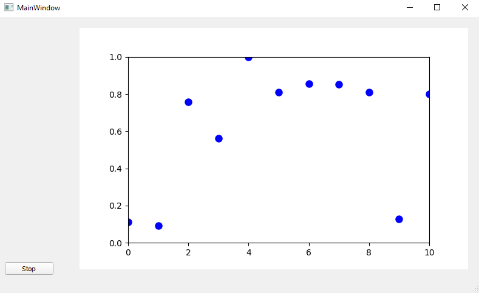

# Python GUI setup with PyQt5
Basic code setup for GUI development with PyQt5 and its Designer tool that implements a custom widget for matplotlib and live updates using QtThreads.

&nbsp;

## Requirements

```bash
pip install pyqt5
```

&nbsp;

## Usage

Simply copy the `code` folder to start developping your own GUI. 

You can run this basic GUI by running `main.py`. 



&nbsp;

## Updating the UI

1. Open the `.ui` file of interest with the Designer program that comes with PyQt. Designer is usually inside `Anaconda/Library/bin/`.

2. Modify the UI (remember to rename objects with good names) and save (replacing old `.ui` file). And that's it. 

   - If it's a new window, access the object again by calling PyQt5's loader from `uic` module as we did for our main window:

     ```python
     mainWindowPath = os.path.join(os.path.dirname(os.path.realpath(__file__)),
                                   'ui', 'mainWindow.ui')
     Ui_MainWindow, QtBaseClass = loadUiType(mainWindowPath)
     ```

And this should work. 
